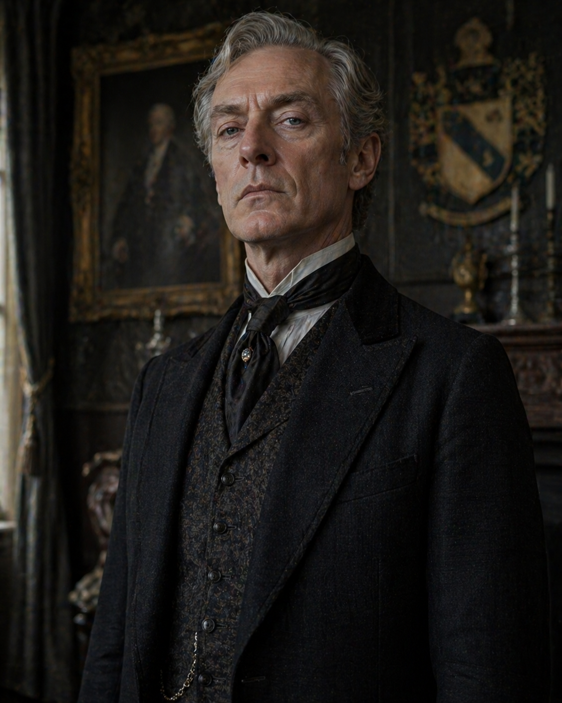

# Lord Halven Briarwell
Head of the family at Fairbrook Manor  in [[Brunswurf Town Info]]. 

A tall, thinning man in his late fifties, with carefully kept silver hair and a narrow, composed face that rarely shows emotion. He dresses impeccably, favoring muted, expensive fabrics, and carries himself with quiet authority. His pale grey eyes are sharp and calculating, always assessing people as if they were pieces on a board.
He has been appointed Mayor of [[Brunswurf Town Info]].

